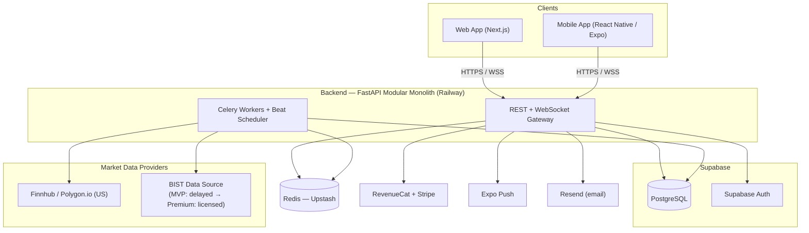
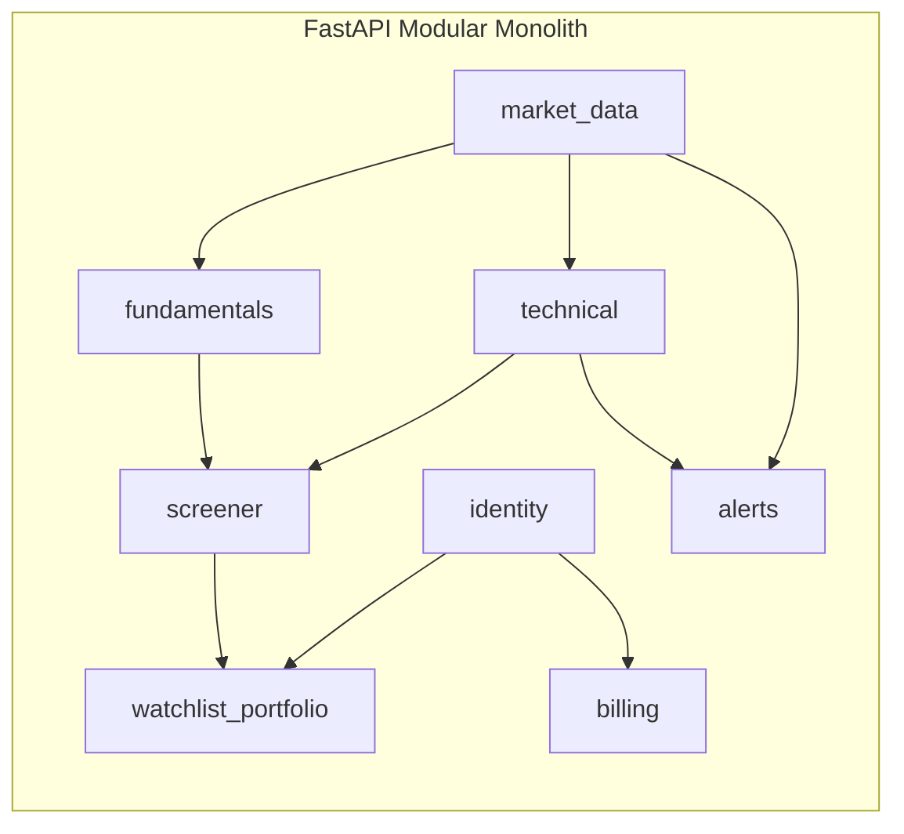
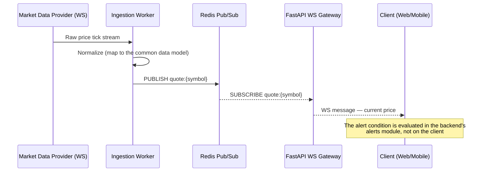
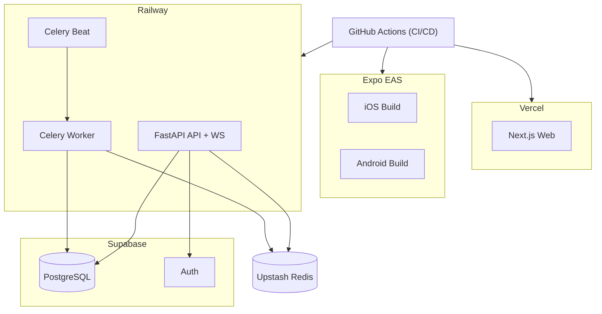

# Boursea — System Architecture

*This is the English translation of [`docs/architecture.md`](architecture.md), which remains the source of truth. If the two ever disagree, the Turkish version wins until this file is re-synced.*

## 1. Architectural Paradigm

**"Modular Monolith on Managed Platforms"**

A single FastAPI service is split into internal modules with clear boundaries (bounded contexts); "boring but critical" needs like authentication, the database, billing, and push notifications are delegated to managed services wherever possible. Goal: build a foundation a **single developer** can ship to production within a few months, but one where individual services can be peeled off and scaled independently once user and data volume grow.

This paradigm is directly tied to the risk flagged in the PRD: a broad feature scope + a solo developer + a few-month target. Approaches like a microservices architecture, multiple database technologies, or standing up your own infrastructure are not realistic under these constraints — so every decision here follows the principle of "few moving parts, managed services, proven technology."

**Why this paradigm (vs. the alternatives):**
- *Modular monolith* over microservices: for a solo developer, the operational overhead (N deployments, N logs/monitors, inter-service network failures) buys nothing that offsets its cost. If modules are cleanly separated, they can be pulled out into their own services later once there's a real, proven scaling need (see AD-1).
- *Managed platforms* (Supabase, Vercel, Railway) over your own/self-hosted infrastructure: the user explicitly stated a preference for "managed services"; this is also the right default for a solo developer.
- *A long-lived FastAPI process* over fully serverless (e.g. edge functions only): real-time WebSocket connections and a background screening/alert engine need persistent processes; pure serverless doesn't fit that need well.

## 2. Technology Choices (Summary Table)

| Layer | Choice | Rationale |
|---|---|---|
| **Web Frontend** | Next.js (React, TypeScript), App Router | A mature ecosystem for a solo developer; zero-ops deployment via Vercel |
| **Mobile Frontend** | React Native + Expo (TypeScript) | Same language (TS) as web, with meaningful business-logic/type sharing; easy build/deploy via Expo EAS |
| **Charting Library** | TradingView Lightweight Charts (Apache-2.0, open source) | The de facto standard for financial charts, lightweight (~35KB), native on web; the same component is used on mobile via a WebView bridge |
| **Backend** | Python + FastAPI (async) | The user's preferred ecosystem; the de facto standard for Python API development as of 2026, strong async/WebSocket support |
| **Background Jobs** | Celery + Redis broker | A mature, well-documented solution for scheduled/async work (data fetching, screening, alert checks) |
| **Database** | PostgreSQL (managed on Supabase) | The right choice for financial/portfolio data that needs relational integrity; Supabase provides auth and realtime from the same platform |
| **Time-Series (candle/OHLCV) Storage** | PostgreSQL, native partitioning (monthly) | A separate time-series database isn't needed at MVP scale; TimescaleDB can be evaluated later (see Deferred Decisions) |
| **Cache / Pub-Sub / Queue** | Redis (Upstash) | A single tool for live price broadcasting (pub/sub), the Celery broker, and rate-limit counters |
| **Authentication** | Supabase Auth (email + Google/Apple OAuth) | Avoids writing an in-house auth system; JWTs are verified on the FastAPI side |
| **US Market Data** | Finnhub (MVP) → Polygon.io (premium/scale) | Finnhub's generous free tier is enough for MVP validation; Polygon.io's WebSocket + minute-level data strength is evaluated for the premium tier |
| **BIST Market Data** | MVP: free/delayed source → Premium: a licensed provider (choice among Foreks / Matriks / Algolab, a business decision) | An open question from the PRD; the architecture isolates this behind an adapter pattern so a provider change doesn't touch business logic (see AD-5) |
| **Subscriptions / Billing** | RevenueCat (one API for App Store + Play + Stripe web) | Avoids hand-writing receipt validation for 3 platforms; free up to $2,500 MTR |
| **Push Notifications** | Expo Push Notification Service | Integrates directly with RN/Expo, no extra infrastructure needed |
| **Email** | Resend | A simple API, modern and solo-dev-friendly for transactional email |
| **Web Hosting** | Vercel | Zero-ops for Next.js, preview deployments |
| **Mobile Distribution** | Expo EAS Build/Submit | Automatic build-submit to the App Store/Play Store |
| **Backend Hosting** | Railway | Container-based, low operational overhead for FastAPI + WebSocket + Celery worker/beat |
| **Error Tracking** | Sentry | A single pane of glass for web+mobile+backend errors; the free tier is enough |
| **CI/CD** | GitHub Actions | Automatic deployment trigger for Vercel/Railway/EAS |
| **Monorepo Tooling** | pnpm workspaces + Turborepo (frontend side) | Type/package sharing between web and mobile |

## 3. System Context



## 4. Architecture Decisions (AD)

Each decision states what it **Binds**, what deviation it **Prevents**, and the **Rule** for how it's applied going forward.

### AD-1 — Modular Monolith
- **Binds:** All backend code lives in a single deployable FastAPI service, split into internal modules along bounded contexts (see Section 5).
- **Prevents:** Premature microservice splitting; a solo developer being buried under N services' worth of deploy/monitoring/debugging overhead.
- **Rule:** A capability is only pulled out into its own service once there's a proven independent scaling need or an independent release cadence — never by default.

### AD-2 — Language/Runtime Split and Type Sharing
- **Binds:** Backend is Python/FastAPI; frontend (web + mobile) is TypeScript. The backend produces an OpenAPI schema; frontend client types are auto-generated from that schema (e.g. via `openapi-typescript`).
- **Prevents:** Hand-synchronized type definitions between frontend and backend that drift apart over time.
- **Rule:** The shared client is regenerated on every backend endpoint change; the frontend does not consume the change before that step is done.

### AD-3 — Single Data Platform (Supabase)
- **Binds:** All persistent relational state lives in a single Supabase PostgreSQL instance; Supabase Auth issues the JWTs that FastAPI verifies.
- **Prevents:** Polyglot-persistence complexity from multiple database technologies at the MVP stage.
- **Rule:** Any new persistent entity is a table in this Postgres instance unless another AD says otherwise (Redis is cache/queue, not the system of record).

### AD-4 — Real-Time Delivery Through the Backend
- **Binds:** All client real-time updates (price ticks, alert triggers) flow through the FastAPI WebSocket gateway + Redis pub/sub.
- **Prevents:** Client apps carrying market-data-provider API keys or talking to a provider directly (security + provider ToS violations + provider-switching cost risk).
- **Rule:** Swapping a market-data provider only touches the ingestion module — client apps never change.

### AD-5 — Market Data Provider Abstraction
- **Binds:** A single internal `MarketDataProvider` interface; a Finnhub/Polygon adapter for the US, a swappable adapter for BIST (a free/delayed source first, then a licensed provider).
- **Prevents:** Provider-specific data formats leaking into the screener/technical/fundamentals modules; an app-wide rewrite once the BIST provider decision lands.
- **Rule:** Adding a new data provider means writing a single adapter that implements the existing interface.

### AD-6 — Time-Series Storage: Native Postgres Partitioning
- **Binds:** OHLCV (candle) history is kept in Postgres tables partitioned by month.
- **Prevents:** Adding a second database engine (e.g. TimescaleDB) before a real need is demonstrated at MVP scale.
- **Rule:** Only revisit this if query/storage performance concretely degrades at a given partition size (see Deferred Decisions).

### AD-7 — Single Source of Truth for Subscriptions: RevenueCat
- **Binds:** The `billing` module talks only to the RevenueCat API/webhooks; App Store/Play receipts are never processed directly.
- **Prevents:** Hand-written receipt validation for 3 platforms (App Store, Play, Stripe web) — the single most exhausting task for a solo developer building a freemium app.
- **Rule:** Feature-access checks always resolve from the backend's cached entitlement state; the client is never asked "what tier are you on."

### AD-8 — Scheduled/Async Work: Celery + Redis
- **Binds:** All periodic/async jobs (data fetching, end-of-day fundamentals refresh, screen re-evaluation, alert checks) are Celery tasks in the same codebase, run by separate worker + beat processes.
- **Prevents:** Cron scripts scattered outside the app's observability/dependency boundary.
- **Rule:** A new periodic job is a Celery beat entry — never a cron job hitting an external HTTP endpoint.

### AD-9 — Single Charting Engine: TradingView Lightweight Charts
- **Binds:** The same charting library is used natively on web and via a WebView bridge on mobile; both platforms consume the same normalized candle-data contract from the backend.
- **Prevents:** Two separate charting implementations that each need their own maintenance.
- **Rule:** A new indicator overlay is added as a Lightweight Charts series/plugin and becomes usable on both platforms at once.

## 5. Backend Module Boundaries



| Module | Responsibility | Related PRD FRs |
|---|---|---|
| `identity` | Supabase Auth integration, user profile, language preference | FR-060, FR-090 |
| `market_data` | Provider adapters, normalization, ingestion, price cache | FR-001, FR-002, FR-020 |
| `fundamentals` | Fundamental metric computation/storage, sector comparison | FR-010, FR-011, FR-013 |
| `technical` | Indicator computation, rule-based signal engine | FR-021–FR-024 |
| `screener` | Multi-criteria screening query engine, saved screens, comparison | FR-030–FR-032 |
| `watchlist_portfolio` | Watchlists, portfolio positions, profit/loss computation | FR-040, FR-050–FR-052 |
| `alerts` | Alert rule definition, triggering, notification dispatch | FR-041–FR-043, FR-070 |
| `billing` | RevenueCat webhooks, entitlement sync | FR-080–FR-083 |

## 6. Real-Time Data Flow



## 7. Data Model (Seed — Top-Level Entities)

> This section is a valid starting point (seed) until code is written; the code will own the full schema.

- `users` (synced with Supabase Auth; language preference, sign-up date)
- `watchlists` → `watchlist_items` (symbol, added date, note)
- `portfolios` → `positions` (symbol, quantity, cost price)
- `alerts` (user, symbol, condition type [price/indicator], threshold, status)
- `saved_screens` (user, criteria set as JSON, name)
- `symbols` (symbol, exchange, company name, sector, industry)
- `fundamentals_snapshot` (symbol, date, P/E, P/B, ROE, ROA, EPS, dividend yield, debt-to-equity, etc.)
- `candles` (symbol, timeframe, open/high/low/close/volume, partitioned by month)
- `subscriptions` (user, RevenueCat entitlement status, plan)

## 8. Deployment and Environments



**Environments:** `development` (local + a free Supabase project), `staging` (Vercel preview + a Railway staging service + a separate Supabase project), `production`. Database migrations (Alembic) are applied automatically as a CI step in every environment.

## 9. Security

| Topic | Approach |
|---|---|
| Authentication | Supabase Auth (OAuth + email); the JWT is verified in FastAPI middleware on every request |
| Data encryption | At-rest encryption on Supabase Postgres (platform default); all traffic over TLS (HTTPS/WSS) |
| Secrets management | API keys (Finnhub/Polygon/BIST provider, RevenueCat, Resend) live only in backend environment variables; never sent to the client (see AD-4) |
| Rate limiting | Redis-based rate limiting, especially on the screener/search endpoints |
| Authorization | A user can only access their own watchlist/portfolio/alert records (row-level ownership check); a single user role (no separate admin role at MVP) |
| Disclaimer | A "not investment advice" notice appears on every screen as a fixed frontend component |

## 10. Observability and Operations

- **Error tracking:** Sentry (web + mobile + backend), with email alerts for critical errors.
- **Logging:** Structured (JSON) logs via Railway's built-in log collector; no separate logging stack (ELK, etc.) at MVP.
- **Metrics:** Provider API call volume/limits (critical for cost tracking — Finnhub/Polygon rate-limit breaches should be caught early), the number of connected WebSocket clients, Celery queue lag.
- **Uptime monitoring:** A simple external healthcheck service (e.g. UptimeRobot's free tier) watches the `/health` endpoint.

## 11. Deferred Decisions

- **BIST real-time data provider selection** (Foreks / Matriks / Algolab / other) — a business decision dependent on cost and contract terms; the architecture isolates this behind the AD-5 adapter pattern, so once decided it's a single adapter implementation.
- **BIST fundamentals data source** — scraping KAP (the Public Disclosure Platform) vs. a licensed provider? Since KAP has no official public API, a scraping-based solution is fragile against format changes; this risk stays open until it's accepted or a licensed source is adopted.
- **ML-based personalization and signal scoring** (PRD FR-025, FR-063) — Phase 2; which model/infrastructure to use hasn't been designed yet, only assumed to consume the existing normalized data models.
- **Customizable metric-weighting engine** (PRD FR-012) — Phase 2.
- **Migrating to TimescaleDB** — only to be evaluated if native partitioning under AD-6 concretely proves insufficient.
- **Multi-region strategy** — MVP assumes a single-region deployment; the latency gap between US and Turkish users will be monitored post-launch and addressed if needed.

## 12. Suggested Repo Structure (Seed)

> Not a binding rule — the real structure supersedes this once code is written.

```
boursea/
├── apps/
│   ├── web/          # Next.js
│   ├── mobile/        # React Native / Expo
│   └── api/            # FastAPI (Python)
├── packages/
│   └── shared/        # Generated API client types, shared utilities
├── docs/
│   ├── PRD.md
│   └── architecture.md
```

## 13. Next Steps

1. This document should be reviewed by the user, finalizing AD-5, AD-6, and the BIST data-provider decisions.
2. Screen flows/wireframes via `bmad-ux`.
3. Epic/story breakdown of the Phase 1 (MVP) FRs via `bmad-create-epics-and-stories`.
4. License/cost negotiation with BIST data providers (Foreks, Matriks, Algolab) — a business-side action, outside engineering.
