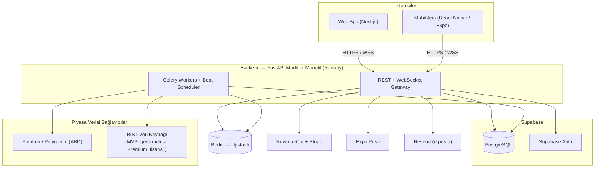
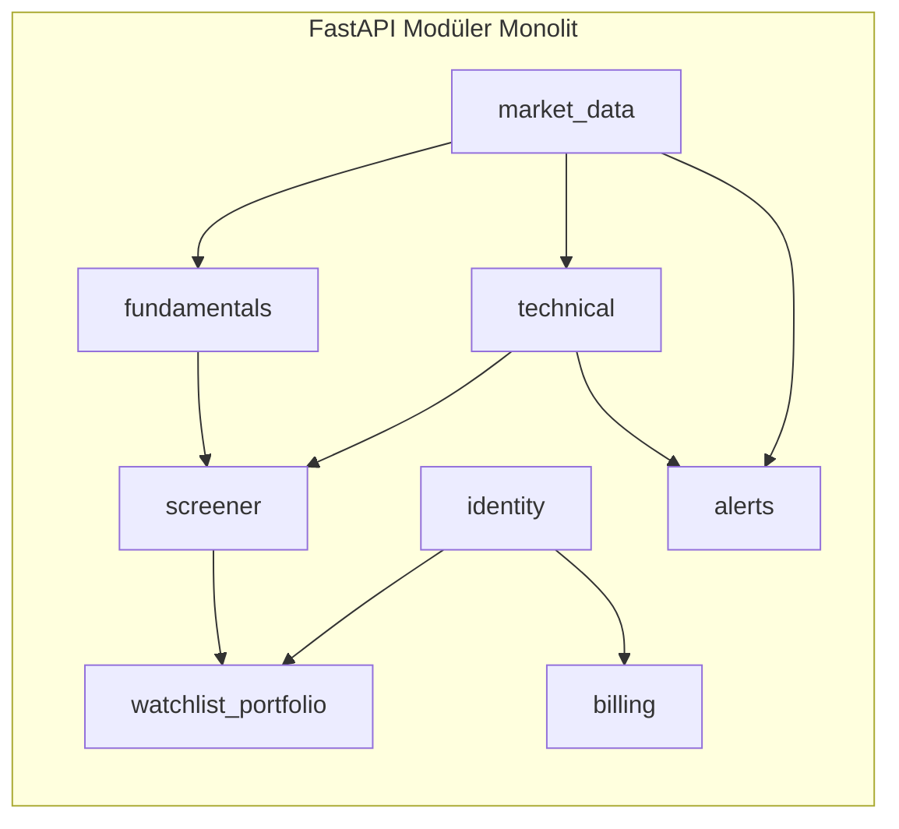
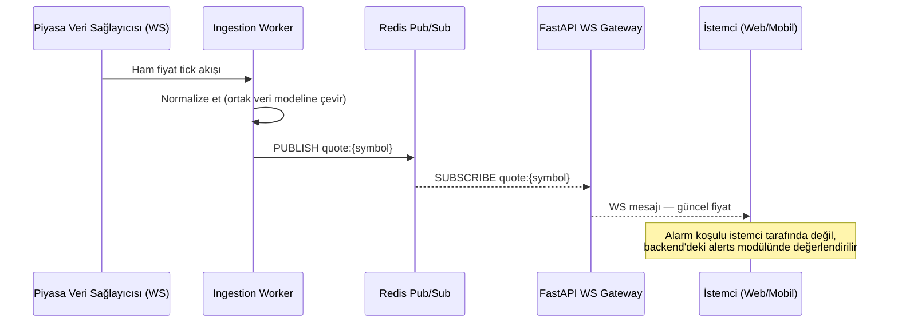
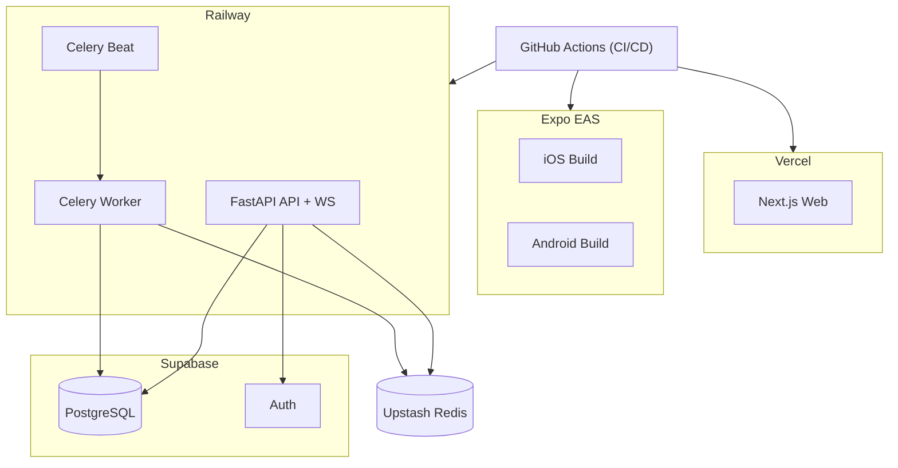

# Trendus — Sistem Mimarisi

## 1. Mimari Paradigma

**"Yönetilen Platformlar Üzerinde Modüler Monolit"**

Tek bir FastAPI servisi, net sınırlara sahip iç modüllere (bounded context) ayrılır; kimlik doğrulama, veritabanı, ödeme ve push bildirim gibi "sıkıcı ama kritik" ihtiyaçlar mümkün olduğunca yönetilen (managed) servislere devredilir. Amaç: **tek geliştiricinin** birkaç ay içinde production'a çıkabileceği, ama kullanıcı ve veri hacmi büyüdüğünde tek tek servisleri koparıp ölçeklendirebileceği bir temel kurmak.

Bu paradigma, PRD'de işaretlenen risk ile doğrudan ilişkilidir: geniş özellik kapsamı + solo geliştirici + birkaç aylık hedef. Mikroservis mimarisi, çoklu veritabanı teknolojisi veya kendi altyapını kurma gibi yaklaşımlar bu kısıtlar altında gerçekçi değildir — bu yüzden her karar "az sayıda hareketli parça, yönetilen servis, kanıtlanmış teknoloji" ilkesine göre alınmıştır.

**Neden bu paradigma (alternatiflere karşı):**
- *Mikroservisler* yerine modüler monolit: Solo geliştirici için operasyon yükü (n adet deploy, n adet log/izleme, servisler arası ağ hataları) kazanılan hiçbir şeyi karşılamaz. Modüller net sınırlarla ayrılırsa, ileride gerçek bir ölçek ihtiyacı doğduğunda tek tek servis olarak çıkarılabilirler (bkz. AD-1).
- *Kendi sunucun / self-hosted altyapı* yerine yönetilen platformlar (Supabase, Vercel, Railway): Kullanıcı "yönetilen servisler" tercihini açıkça belirtti; bu aynı zamanda solo geliştirici için doğru varsayılan tercihtir.
- *Tamamen serverless (örn. yalnızca edge fonksiyonları)* yerine uzun ömürlü bir FastAPI süreci: Gerçek zamanlı WebSocket bağlantıları ve arka planda çalışan tarama/alarm motoru için kalıcı süreçler gereklidir; saf serverless bu ihtiyaca iyi oturmaz.

## 2. Teknoloji Seçimleri (Özet Tablo)

| Katman | Seçim | Gerekçe |
|---|---|---|
| **Web Frontend** | Next.js (React, TypeScript), App Router | Solo geliştirici için olgun ekosistem, Vercel ile sıfır-ops dağıtım |
| **Mobil Frontend** | React Native + Expo (TypeScript) | Web ile aynı dil (TS) ve önemli iş mantığı/tip paylaşımı; Expo EAS ile kolay build/dağıtım |
| **Grafik Kütüphanesi** | TradingView Lightweight Charts (Apache-2.0, açık kaynak) | Finans grafikleri için fiili standart, hafif (~35KB), web'de native; mobilde WebView köprüsüyle aynı bileşen kullanılır |
| **Backend** | Python + FastAPI (async) | Kullanıcının tercih ettiği ekosistem; 2026 itibarıyla Python API geliştirmede fiili standart, async/WebSocket desteği güçlü |
| **Arka Plan İşleri** | Celery + Redis broker | Zamanlanmış/asenkron işler (veri çekme, tarama, alarm kontrolü) için olgun, iyi dokümante edilmiş çözüm |
| **Veritabanı** | PostgreSQL (Supabase üzerinde yönetilen) | İlişkisel bütünlük gerektiren finansal/portföy verisi için doğru seçim; Supabase ile auth ve realtime aynı platformdan gelir |
| **Zaman Serisi (mum/OHLCV) Depolama** | PostgreSQL, native partitioning (aylık) | MVP ölçeğinde ayrı bir zaman-serisi veritabanı gerekmez; ileride TimescaleDB değerlendirilebilir (bkz. Ertelenen Kararlar) |
| **Cache / Pub-Sub / Kuyruk** | Redis (Upstash) | Anlık fiyat yayını (pub/sub), Celery broker, rate-limit sayaçları için tek araç |
| **Kimlik Doğrulama** | Supabase Auth (e-posta + Google/Apple OAuth) | Kendi auth sistemini yazmaktan kaçınır; JWT'ler FastAPI tarafında doğrulanır |
| **ABD Piyasa Verisi** | Finnhub (MVP) → Polygon.io (Premium/ölçek) | Finnhub'ın geniş ücretsiz katmanı MVP doğrulaması için yeterli; Polygon.io'nun WebSocket + dakikalık veri gücü premium katmanda değerlendirilir |
| **BIST Piyasa Verisi** | MVP: ücretsiz/gecikmeli kaynak → Premium: lisanslı sağlayıcı (Foreks / Matriks / Algolab arasında seçim, iş kararı) | PRD'deki açık soru; mimari, sağlayıcı değişse de iş mantığını etkilemeyecek şekilde adaptör deseniyle izole edildi (bkz. AD-5) |
| **Abonelik / Ödeme** | RevenueCat (App Store + Play + Stripe web tek API) | 3 platformun makbuz doğrulamasını elle yazmaktan kaçınır; 2.500$ MTR'a kadar ücretsiz |
| **Push Bildirim** | Expo Push Notification Service | RN/Expo ile doğrudan entegre, ek altyapı gerektirmez |
| **E-posta** | Resend | Basit API, transactional e-posta için modern/solo-dev dostu |
| **Web Hosting** | Vercel | Next.js için sıfır-ops, preview deploy'lar |
| **Mobil Dağıtım** | Expo EAS Build/Submit | App Store/Play Store'a otomatik build-submit |
| **Backend Hosting** | Railway | FastAPI + WebSocket + Celery worker/beat için konteyner bazlı, düşük operasyon yükü |
| **Hata İzleme** | Sentry | Web+mobil+backend tek panelde hata takibi, ücretsiz katmanı yeterli |
| **CI/CD** | GitHub Actions | Vercel/Railway/EAS'a otomatik dağıtım tetikleyici |
| **Monorepo Aracı** | pnpm workspaces + Turborepo (frontend tarafı) | Web ve mobil arasında tip/paket paylaşımı |

## 3. Sistem Bağlamı



## 4. Mimari Kararlar (AD)

Her karar; neyi bağladığını (**Binds**), hangi sapmayı önlediğini (**Prevents**) ve gelecekte nasıl uygulanacağını (**Rule**) belirtir.

### AD-1 — Modüler Monolit
- **Binds:** Tüm backend kodu tek bir dağıtılabilir FastAPI servisinde, bounded context'lere göre ayrılmış iç modüllerde yaşar (bkz. Bölüm 5).
- **Prevents:** Erken mikroservis bölünmesi; solo geliştiricinin n adet servisi ayrı ayrı deploy/izleme/hata ayıklama yükü altında kalması.
- **Rule:** Bir yetenek, yalnızca kanıtlanmış bağımsız ölçekleme ihtiyacı veya bağımsız yayın temposu olduğunda ayrı bir servise çıkarılır — varsayılan olarak değil.

### AD-2 — Dil/Runtime Ayrımı ve Tip Paylaşımı
- **Binds:** Backend Python/FastAPI, frontend (web+mobil) TypeScript. Backend OpenAPI şeması üretir; frontend istemci tipleri bu şemadan otomatik üretilir (örn. `openapi-typescript`).
- **Prevents:** Frontend/backend arasında elle senkronize edilen, zamanla sapan tip tanımları.
- **Rule:** Her backend endpoint değişikliğinde paylaşılan istemci yeniden üretilir; frontend bu adım tamamlanmadan tüketmez.

### AD-3 — Tek Veri Platformu (Supabase)
- **Binds:** Tüm kalıcı ilişkisel durum tek bir Supabase PostgreSQL örneğinde yaşar; Supabase Auth, FastAPI tarafından doğrulanan JWT'ler üretir.
- **Prevents:** MVP aşamasında çoklu veritabanı teknolojisi (polyglot persistence) karmaşası.
- **Rule:** Yeni bir kalıcı varlık, aksi bir AD ile belirtilmedikçe bu Postgres örneğinde bir tablodur (Redis önbellek/kuyruktur, sistem kaydı değildir).

### AD-4 — Gerçek Zamanlı Dağıtım Backend Üzerinden
- **Binds:** Tüm istemci gerçek-zamanlı güncellemeleri (fiyat tick'leri, alarm tetiklenmeleri) FastAPI WebSocket gateway'i + Redis pub/sub üzerinden akar.
- **Prevents:** İstemci uygulamalarının piyasa verisi sağlayıcı API anahtarlarını taşıması veya sağlayıcıyla doğrudan konuşması (güvenlik + sağlayıcı sözleşme ihlali + sağlayıcı değişim maliyeti riski).
- **Rule:** Bir piyasa verisi sağlayıcısı değiştirildiğinde yalnızca ingestion modülü etkilenir — istemci uygulamaları hiç değişmez.

### AD-5 — Piyasa Verisi Sağlayıcı Soyutlaması
- **Binds:** Tek bir dahili `MarketDataProvider` arayüzü; ABD için Finnhub/Polygon adaptörü, BIST için değiştirilebilir bir adaptör (önce ücretsiz/gecikmeli kaynak, sonra lisanslı sağlayıcı).
- **Prevents:** Sağlayıcıya özgü veri formatlarının screener/technical/fundamentals modüllerine sızması; BIST sağlayıcı kararı netleştiğinde uygulama genelinde yeniden yazım.
- **Rule:** Yeni bir veri sağlayıcısı eklemek, mevcut arayüzü uygulayan tek bir adaptör yazmaktır.

### AD-6 — Zaman Serisi Depolama: Native Postgres Partitioning
- **Binds:** OHLCV (mum) geçmişi, Postgres'te aylık aralıklarla partition'lanmış tablolarda tutulur.
- **Prevents:** MVP ölçeğinde gerçek ihtiyaç kanıtlanmadan ikinci bir veritabanı motoru (örn. TimescaleDB) eklenmesi.
- **Rule:** Yalnızca belirli bir partition boyutunda sorgu/depolama performansı somut olarak bozulursa yeniden değerlendirilir (bkz. Ertelenen Kararlar).

### AD-7 — Abonelik Doğruluğunun Tek Kaynağı: RevenueCat
- **Binds:** `billing` modülü yalnızca RevenueCat API/webhook'ları ile konuşur; App Store/Play makbuzları doğrudan işlenmez.
- **Prevents:** 3 platform (App Store, Play, Stripe web) için elle makbuz doğrulama — freemium uygulamalarda solo geliştiriciyi en çok yoran iştir.
- **Rule:** Özellik erişim kontrolleri her zaman backend'in önbelleğe aldığı yetki (entitlement) durumundan çözülür; istemciye asla "hangi katmandasın" diye sorulmaz.

### AD-8 — Zamanlanmış/Asenkron İşler: Celery + Redis
- **Binds:** Tüm periyodik/asenkron işler (veri çekme, günsonu temel veri güncelleme, tarama yeniden değerlendirme, alarm kontrolü) aynı kod tabanında Celery task'larıdır; ayrı worker + beat süreçleriyle çalışır.
- **Prevents:** Uygulamanın gözlemlenebilirlik/bağımlılık sınırları dışında dağınık cron script'leri.
- **Rule:** Yeni bir periyodik iş, dışarıdan bir HTTP endpoint'ine vuran bir cron değil, bir Celery beat girdisidir.

### AD-9 — Tek Grafik Motoru: TradingView Lightweight Charts
- **Binds:** Web'de native, mobilde WebView köprüsüyle aynı grafik kütüphanesi kullanılır; her iki platform da backend'den aynı normalize edilmiş mum verisi sözleşmesini tüketir.
- **Prevents:** İki platform için ayrı ayrı bakım gerektiren iki farklı grafik implementasyonu.
- **Rule:** Yeni bir indikatör overlay'i, Lightweight Charts serisi/eklentisi olarak eklenir ve her iki platformda aynı anda kullanılabilir olur.

## 5. Backend Modül Sınırları



| Modül | Sorumluluk | İlgili PRD FR'leri |
|---|---|---|
| `identity` | Supabase Auth entegrasyonu, kullanıcı profili, dil tercihi | FR-060, FR-090 |
| `market_data` | Sağlayıcı adaptörleri, normalizasyon, ingestion, fiyat önbelleği | FR-001, FR-002, FR-020 |
| `fundamentals` | Temel metrik hesaplama/depolama, sektör kıyaslaması | FR-010, FR-011, FR-013 |
| `technical` | İndikatör hesaplama, kural bazlı sinyal motoru | FR-021–FR-024 |
| `screener` | Çoklu kriter tarama sorgu motoru, kayıtlı taramalar, karşılaştırma | FR-030–FR-032 |
| `watchlist_portfolio` | İzleme listeleri, portföy pozisyonları, kâr/zarar hesaplama | FR-040, FR-050–FR-052 |
| `alerts` | Alarm kuralı tanımı, tetikleme, bildirim dispatch | FR-041–FR-043, FR-070 |
| `billing` | RevenueCat webhook'ları, yetki (entitlement) senkronizasyonu | FR-080–FR-083 |

## 6. Gerçek Zamanlı Veri Akışı



## 7. Veri Modeli (Seed — Üst Seviye Varlıklar)

> Bu bölüm kod yazılana kadar geçerli bir başlangıç noktasıdır (seed); tam şema kod tarafından sahiplenilecektir.

- `users` (Supabase Auth ile senkron; dil tercihi, kayıt tarihi)
- `watchlists` → `watchlist_items` (sembol, eklenme tarihi, not)
- `portfolios` → `positions` (sembol, adet, maliyet fiyatı)
- `alerts` (kullanıcı, sembol, koşul tipi [fiyat/indikatör], eşik, durum)
- `saved_screens` (kullanıcı, kriter seti JSON, isim)
- `symbols` (sembol, borsa, şirket adı, sektör, endüstri)
- `fundamentals_snapshot` (sembol, tarih, F/K, PD/DD, ROE, ROA, EPS, temettü verimi, borç/özsermaye vb.)
- `candles` (sembol, zaman dilimi, açılış/yüksek/düşük/kapanış/hacim, ay bazlı partition)
- `subscriptions` (kullanıcı, RevenueCat entitlement durumu, plan)

## 8. Dağıtım ve Ortamlar



**Ortamlar:** `development` (yerel + Supabase ücretsiz proje), `staging` (Vercel preview + Railway staging servisi + ayrı Supabase projesi), `production`. Veritabanı migration'ları (Alembic) her ortamda CI adımı olarak otomatik uygulanır.

## 9. Güvenlik

| Konu | Yaklaşım |
|---|---|
| Kimlik doğrulama | Supabase Auth (OAuth + e-posta); JWT her istekte FastAPI middleware'inde doğrulanır |
| Veri şifreleme | Supabase Postgres'te "at rest" şifreleme (platform varsayılanı); tüm trafik TLS (HTTPS/WSS) |
| Sır yönetimi | API anahtarları (Finnhub/Polygon/BIST sağlayıcı, RevenueCat, Resend) yalnızca backend ortam değişkenlerinde; istemciye asla gönderilmez (bkz. AD-4) |
| Hız sınırlama | Redis tabanlı rate limiting, özellikle screener/arama endpoint'lerinde |
| Yetkilendirme | Kullanıcı yalnızca kendi watchlist/portföy/alarm kayıtlarına erişir (row-level ownership check); tek kullanıcı rolü (özel admin rolü MVP'de yok) |
| Sorumluluk reddi | Her ekranda "yatırım tavsiyesi değildir" ibaresi frontend'de sabit bileşen olarak yer alır |

## 10. Gözlemlenebilirlik ve Operasyon

- **Hata izleme:** Sentry (web + mobil + backend), kritik hata için e-posta uyarısı.
- **Loglama:** Yapılandırılmış (JSON) loglar, Railway'in yerleşik log toplayıcısı; MVP'de ayrı bir log altyapısı (ELK vb.) kurulmaz.
- **Metrikler:** Sağlayıcı API çağrı hacmi/limitleri (maliyet takibi için kritik — Finnhub/Polygon rate limit aşımı erken tespit edilmeli), WebSocket bağlı istemci sayısı, Celery kuyruk gecikmesi.
- **Uptime izleme:** Basit bir dış healthcheck servisi (örn. UptimeRobot ücretsiz katman) `/health` endpoint'ini izler.

## 11. Ertelenen Kararlar (Deferred)

- **BIST gerçek zamanlı veri sağlayıcısı seçimi** (Foreks / Matriks / Algolab / diğer) — maliyet ve sözleşme koşullarına bağlı bir iş kararı; mimari bunu AD-5'teki adaptör deseniyle izole ediyor, karar netleştiğinde tek bir adaptör yazımıyla devreye alınır.
- **BIST temel veri kaynağı** — KAP (Kamuyu Aydınlatma Platformu) taraması mı yoksa lisanslı sağlayıcı mı? KAP'ın resmi bir genel API'si olmadığından, taramaya dayalı bir çözüm format değişikliklerine karşı kırılgan olur; bu risk kabul edilene veya lisanslı bir kaynağa geçilene kadar açık kalır.
- **ML tabanlı kişiselleştirme ve sinyal skorlama** (PRD FR-025, FR-063) — Faz 2; hangi model/altyapının kullanılacağı henüz tasarlanmadı, yalnızca mevcut normalize veri modellerini tüketeceği varsayılıyor.
- **Özelleştirilebilir metrik ağırlıklandırma motoru** (PRD FR-012) — Faz 2.
- **TimescaleDB'ye geçiş** — yalnızca AD-6'daki native partitioning somut biçimde yetersiz kalırsa değerlendirilecek.
- **Çoklu bölge (multi-region) stratejisi** — MVP tek bölgeli dağıtım varsayıyor; ABD ve Türkiye kullanıcıları arasında gecikme farkı üretime çıktıktan sonra izlenip gerekirse ele alınacak.

## 12. Önerilen Repo Yapısı (Seed)

> Bağlayıcı bir kural değildir — kod yazılmaya başlandığında gerçek yapı burayı geçersiz kılar.

```
trendus/
├── apps/
│   ├── web/          # Next.js
│   ├── mobile/        # React Native / Expo
│   └── api/            # FastAPI (Python)
├── packages/
│   └── shared/        # Üretilen API client tipleri, ortak yardımcılar
├── docs/
│   ├── PRD.md
│   └── architecture.md
```

## 13. Sonraki Adımlar

1. Bu doküman kullanıcı tarafından gözden geçirilip AD-5, AD-6 ve BIST veri sağlayıcı kararları netleştirilmeli.
2. `bmad-ux` ile ekran akışları/wireframe çalışması.
3. `bmad-create-epics-and-stories` ile Faz 1 (MVP) FR'lerinin epic/story kırılımı.
4. BIST veri sağlayıcıları (Foreks, Matriks, Algolab) ile lisans/maliyet görüşmesi (iş tarafı, mühendislik dışı bir aksiyon).
